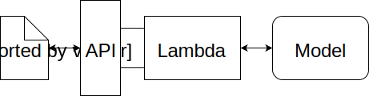
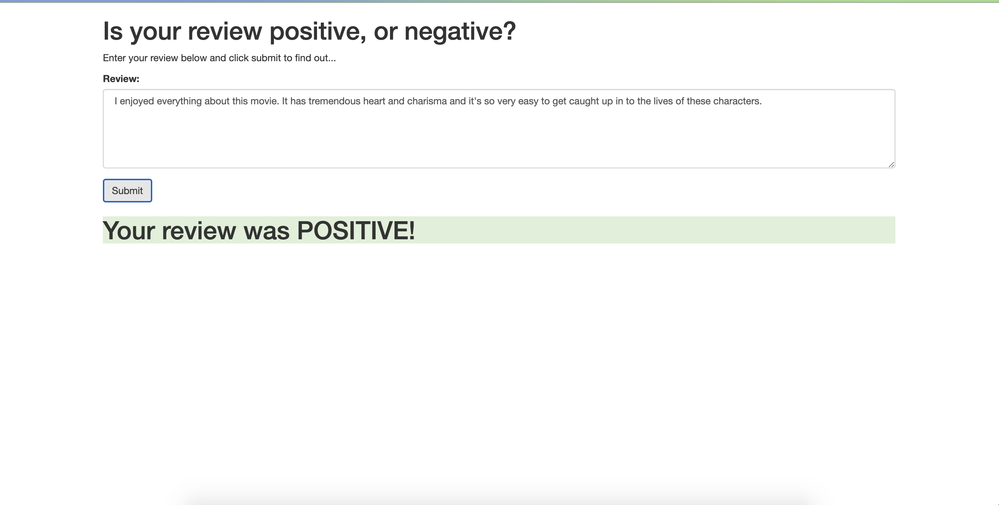
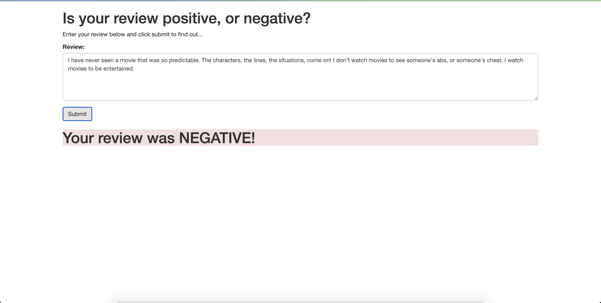

# SageMaker Deployment Project

The notebook and Python files provided here create a simple web app which interacts with a deployed recurrent neural network performing sentiment analysis on movie reviews using PyTorch. The model has been trained on AWS SageMaker and deployed on AWS resources. 

AWS API-gateway was used to create the API methods. When the review is posted using the webapp, the gateway POST method forwards the request to a lambda function. The lambda function passes the review to the deployed endpoint of the model on SageMaker and collects the results of the analysis and passes it back to the API-gateway which displays the result on the webapp. The architecture is as shown below:

Screenshot for the webapp are shown below:

